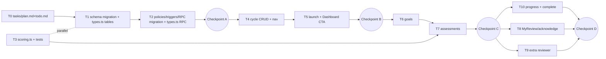

# Implementation Plan: Performance Appraisal Cycles

## Context

SIA's onboarding "Launch" step dead-ends in a "coming soon" toast (`src/pages/Dashboard.tsx:206`, `handleCta`). This plan implements the full appraisal lifecycle: HR admin configures windows and launches a cycle; managers set weighted goals and submit interim + final assessments; the system computes the weighted overall score; employees acknowledge.

**⚠️ SPEC.md is not in this repository clone.** It was approved in the local session but never committed, so the implementer cannot reference it. This plan is therefore **self-contained**: the data model and business rules the spec defined are embedded below in "Spec summary" and are the source of truth for implementation. (If the user pushes SPEC.md later, reconcile; nothing here should conflict.)

**Output convention:** the `/plan` command expects `tasks/plan.md` + `tasks/todo.md` (directory doesn't exist yet). Task 0 (post-approval) creates both from this plan.

## Spec summary (embedded — source of truth)

### Data model

- **`organizations`** (existing) — add `interim_weight_pct int NOT NULL DEFAULT 30`, `final_weight_pct int NOT NULL DEFAULT 70`, `CHECK (interim_weight_pct + final_weight_pct = 100)`.
- **`appraisal_cycles`** — `id`, `organization_id` (FK, CASCADE), `name text NOT NULL`, `status text NOT NULL DEFAULT 'draft' CHECK (status IN ('draft','active','completed'))`, and 7 DATE columns: `goal_window_start`, `goal_window_end`, `interim_window_start`, `interim_window_end`, `final_window_start`, `final_window_end`, `acknowledgement_due` — all NOT NULL, CHECK-ordered (each start ≤ its end; goal ≤ interim ≤ final ≤ ack).
- **`cycle_participants`** — `id`, `cycle_id` (FK, CASCADE), `employee_id` (FK employees), `manager_id` (FK employees, NOT NULL — a cycle never launches with unmanaged participants), `extra_reviewer_id` (FK employees, nullable), `interim_submitted_at timestamptz`, `final_submitted_at timestamptz`, `interim_score NUMERIC(4,2)`, `final_score NUMERIC(4,2)`, `overall_score NUMERIC(4,2)`, `acknowledged_at timestamptz`, `UNIQUE (cycle_id, employee_id)`. Exclusion from a cycle = row absence.
- **`goals`** — `id`, `participant_id` (FK, CASCADE), `title text NOT NULL`, `description text`, `weight int NOT NULL CHECK (weight BETWEEN 1 AND 100)`. Weights per participant must sum to 100 — enforced in UI (zod) and in the submit RPC (sum-per-row can't be a table CHECK).
- **`goal_ratings`** — `id`, `goal_id` (FK, CASCADE), `stage text NOT NULL CHECK (stage IN ('interim','final'))`, `rating smallint CHECK (rating BETWEEN 1 AND 5)`, `manager_comment text`, `reviewer_comment text`, `UNIQUE (goal_id, stage)`.

### Scoring (2-dp, matching NUMERIC(4,2))

- `stage_score = Σ(rating × weight) / 100` (max 5.00)
- `overall_score = interim_score × interim_weight_pct/100 + final_score × final_weight_pct/100`

### Rules the DB must enforce ("never do" list)

1. Clients never write scores or `*_submitted_at`/`acknowledged_at` timestamps directly — only the `submit_assessment_stage` RPC sets scores + submit timestamps; acknowledge sets only `acknowledged_at`.
2. No goal/rating writes outside the stage's date window, when the cycle isn't `active`, or after that stage's `*_submitted_at` is set.
3. Managers can only write goals/ratings for their own reports (join via `cycle_participants.manager_id` → caller's employee row); hr_admin can act everywhere in their org.
4. The extra reviewer may edit `reviewer_comment` only — never `rating`/`manager_comment`.
5. Employees see their ratings/comments only after `final_submitted_at`; goals are visible throughout.
6. Acknowledge is impossible until `overall_score` is present.
7. Tenant isolation on every new table (RESTRICTIVE policy on `organization_id`, derived via cycle→org for child tables).

### Lifecycle

`draft` (HR configures dates, resolves unmanaged employees) → **Launch** (bulk-insert participants, `status='active'`, completes onboarding) → goal window → interim window (submit locks interim) → final window (submit computes overall, locks) → employee acknowledgement → **Complete** (allowed once `acknowledgement_due` passed or all acknowledged; terminated participants shown frozen, excluded from denominators).

## Architecture decisions

1. **RLS follows the newest pattern** — `public.current_user_org_id()` (SECURITY DEFINER helper from migration `20260705042633`) + role check via `(SELECT role FROM profiles WHERE id = auth.uid())`, mirroring the employees migration `20260705043641` (grants → enable RLS → permissive role policies → RESTRICTIVE tenant policy → `update_updated_at_column` trigger).
2. **Authoritative scoring in a SQL RPC; TS mirror for UI + tests.** `submit_assessment_stage(p_participant_id uuid, p_stage text)` (SECURITY DEFINER) validates caller, window, weight sum, all-goals-rated; computes and stores stage score (and overall at final); stamps the timestamp — atomically. `src/lib/scoring.ts` implements identical math for live form preview and unit tests; shared test vectors documented in the RPC comment guard against drift.
3. **Caller→employee resolution** via `employees.profile_id = auth.uid()`. Most imported employees have no profile (invitations out of scope), so manager/employee screens show an empty state for unlinked users and **hr_admin sees all participants on every screen** — that's the demo/driving path for v1.
4. **Window + lock enforcement in DB triggers** (`BEFORE INSERT OR UPDATE` on `goals` and `goal_ratings`): reject writes outside the window (`now()::date` vs DATE columns, inclusive), when cycle ≠ `active`, or after the stage is submitted. A column-guard trigger on `goal_ratings` rejects non-manager changes to `rating`/`manager_comment`; one on `cycle_participants` restricts direct client UPDATEs to `extra_reviewer_id` (manager/hr, pre-final) and `acknowledged_at` (employee, only when `overall_score IS NOT NULL`). Raise with distinctive messages (e.g. `SIA_WINDOW_CLOSED`, `SIA_STAGE_LOCKED`, `SIA_COLUMN_FORBIDDEN`) so hooks can map them to friendly toasts. UI disables the same actions; DB is the real gate.
5. **New route namespace `/appraisals`** (`ProtectedRoute` + `AppLayout` wrappers like existing routes in `App.tsx`), one "Appraisals" item added to `navItems` in `AppSidebar.tsx` (`CalendarClock`, `--accent-yellow` — matches the onboarding step's accent).
6. **Hand-extend `src/integrations/supabase/types.ts`.** The client is `createClient<Database>` (`src/integrations/supabase/client.ts`), so `.from("appraisal_cycles")` etc. won't typecheck until the generated types know the tables. Lovable regenerates this file on deploy; until then, hand-written entries (Row/Insert/Update per table, the enum-ish CHECK columns as string unions, the RPC under `Functions`, the two new `organizations` columns) keep the codebase type-safe. Keep edits mechanical so regeneration is a no-op diff.

## Reuse map (verified against the code)

- Hook shape: `src/hooks/useEmployees.ts` (useQuery keyed by `organization?.id`, mutations with `qc.invalidateQueries`, `enabled: !!organization`).
- Schema shape: `src/lib/employeeSchema.ts` (zod **v4** — repo is on `zod ^4.4.3`; `FormValues` type, `empty*Form()`, `toDbPayload()`).
- Onboarding completion: `useOnboarding().markComplete("cycle")` already sets `cycle_complete` + `setup_complete` (`src/hooks/useOnboarding.ts:129`).
- Role: `useAuth().profile.role` ∈ `hr_admin | manager | employee` (`src/contexts/AuthContext.tsx`).
- Card/typography idiom: `Dashboard.tsx` aside cards (`rounded-xl border border-[hsl(var(--hairline))] bg-[hsl(var(--surface-raised))]`), `SummaryStat`.
- Migration idiom: `supabase/migrations/20260705043641_*.sql`; `update_updated_at_column()` already exists.
- Test setup: vitest + jsdom + testing-library configured (`vitest.config.ts`, `src/test/`); `npm test` runs `vitest run`.
- shadcn primitives already installed (dialog, select, form, tabs, tooltip, etc.).

## Task dependency shape

## Task list

### Phase 0
**Task 0 — Write `tasks/plan.md` and `tasks/todo.md`** from this plan (XS; `/build` convention).

### Phase 1: Foundation

**Task 1 — Migration: appraisal schema + baseline RLS; extend generated types** (M; 1 SQL file + `types.ts` edit)
New migration per the Spec summary data model: `organizations` weight columns; four tables with constraints and indexes (`(organization_id)` on cycles; `(cycle_id)`, `(employee_id)`, `(manager_id)` on participants; `(participant_id)` on goals; `(goal_id)` on ratings); GRANTs to `authenticated`/`service_role` before enabling RLS; org-wide SELECT policies; hr_admin full-access policies; RESTRICTIVE tenant-isolation policies (child tables derive org via join to `appraisal_cycles`); `updated_at` triggers. Hand-add table entries to `src/integrations/supabase/types.ts`.
- **Accept:** all four tables exist with the constraints above; RLS enabled; style matches the employees migration; `npm run build` green with typed `.from()` calls.
- **Verify:** SQL review against Spec summary; migration applies cleanly on Lovable Cloud.

**Task 2 — Migration: role policies, triggers, submit RPC; types.ts Functions entry** (M; 1 SQL file + `types.ts` edit)
Manager INSERT/UPDATE/DELETE policies on `goals`/`goal_ratings` (participant's `manager_id` → caller's employee row via `profile_id = auth.uid()`); extra-reviewer UPDATE policy on `goal_ratings`; employee SELECT-own policies (ratings/comments only after `final_submitted_at`); employee UPDATE policy on own participant row (acknowledge); the window/lock/column-guard triggers and `submit_assessment_stage` RPC from Architecture decisions 2 & 4, with distinctive error messages. Add the RPC to `types.ts` `Functions`.
- **Accept:** every item in the "never do" list is enforced by DB, not UI; the RPC is the only path that sets scores/submit timestamps.
- **Verify:** SQL review; adversarial checks (manager rates another manager's report → denied; reviewer updates `rating` → denied; write after submit / outside window → denied; direct UPDATE of `overall_score` → denied).

**Task 3 — `src/lib/scoring.ts` + unit tests** (S; 2 files; parallel-safe with 1–2)
`stageScore(ratings: {rating, weight}[], ...)` and `overallScore(interim, final, interimPct, finalPct)`; `src/test/scoring.test.ts` covering uneven weights, missing/partial ratings (throws or null), 2-dp rounding. Test vectors copied into the RPC's comment (Task 2) to pin SQL/TS parity.
- **Accept:** pure module, no Supabase import; math identical to RPC.
- **Verify:** `npm test`.

**Checkpoint A:** migrations applied on Lovable Cloud; `npm test` + `npm run lint` + `npm run build` green. Human review of SQL before dependent UI work.

### Phase 2: HR admin slice (create → launch)

**Task 4 — Cycle CRUD: schema, hook, list page, nav** (M; ~5 files)
`src/lib/cycleSchema.ts` (name + 7 dates; zod v4 `superRefine` enforcing the window ordering); `src/hooks/useAppraisalCycles.ts` (useEmployees shape); `src/pages/AppraisalCycles.tsx` (hr_admin: list + create dialog; others: read-only list); routes in `App.tsx` (`/appraisals`, `/appraisals/:id`); `AppSidebar.tsx` nav item.
- **Accept:** hr_admin creates a `draft` cycle; date ordering validates client-side and via DB CHECKs; non-admin sees list only.
- **Verify:** component test for date-order validation; manual create via `/run`.

**Task 5 — Launch flow + Dashboard wiring** (M; ~4 files)
`src/pages/AppraisalCycleDetail.tsx` draft view: windows summary; participant preview (all `employment_status='active'` employees); unmanaged-employee resolution (inline manager select, or exclude toggle = no participant row) — **Launch disabled until every included employee has a manager**; Launch → bulk-insert `cycle_participants`, set `status='active'`, call `useOnboarding().markComplete("cycle")`. In `Dashboard.tsx` `handleCta` (line ~204), replace the `toast.info("...coming soon")` branch with navigation to `/appraisals` (add `useNavigate`; the other branch already uses `window.location.assign`).
- **Accept:** cycle never launches with unmanaged participants; onboarding completes on first launch; Dashboard CTA routes for real.
- **Verify:** manual e2e — create → resolve → launch; dashboard flips to the post-onboarding view.

**Checkpoint B:** admin vertical slice works end-to-end. Human demo/review.

### Phase 3: Manager slice

**Task 6 — Goals: schema, hook, MyGoals page + reviewer picker** (M; ~4 files)
`src/lib/goalSchema.ts` (title/description/weight; list-level sum-100 check); `src/hooks/useGoals.ts`; `src/pages/MyGoals.tsx` — participants of the active cycle (manager: own reports via `profile_id` link; hr_admin: all, grouped by manager; unlinked non-admin: empty state per Decision 3); goal add/edit/delete with running weight-sum indicator; per-participant extra-reviewer select writing `cycle_participants.extra_reviewer_id`. Route + nav.
- **Accept:** UI flags weight sum ≠ 100 as "not ready"; out-of-window writes are rejected by the trigger and surface as a friendly toast (error-message mapping in the hook).
- **Verify:** component test for weight-sum validation; manual in-window/out-of-window write.

**Task 7 — Assessments: schema, hook, MyAssessments page** (M; ~4 files)
`src/lib/assessmentSchema.ts`; `src/hooks/useAssessments.ts` (draft ratings via upsert on `UNIQUE(goal_id, stage)`; submit via `supabase.rpc("submit_assessment_stage", ...)`); `src/pages/MyAssessments.tsx` — per report, per stage: 1–5 rating + comment per goal, live stage-score preview from `scoring.ts`, **Submit** disabled until all goals rated, read-only lock after submit. Route + nav.
- **Accept:** incremental draft saves; atomic submit computes + locks; interim and final both work; overall score appears after final submit.
- **Verify:** component test (submit disabled until complete); manual interim→final flow; DB-stored scores match the TS preview exactly.

**Checkpoint C:** manager slice works within windows; scores computed. Human review.

### Phase 4: Employee, reviewer, close-out

**Task 8 — MyReview: employee view + acknowledgement** (S; ~2 files)
`src/pages/MyReview.tsx` + small hook: caller's participant row; goals visible throughout; after `final_submitted_at`: overall score, per-goal ratings, manager + reviewer comments, one-click **Acknowledge** → sets `acknowledged_at`. Empty state for unlinked profiles.
- **Accept:** no ratings/comments visible pre-final-submit (RLS-backed); acknowledge disabled until `overall_score` present (DB also rejects).
- **Verify:** component test on acknowledge gating; manual as an hr_admin-linked employee.

**Task 9 — Extra reviewer commenting** (S; ~2 files)
Reviewer mode in the assessment view for participants where the caller is `extra_reviewer_id`: sees ratings/comments, edits `reviewer_comment` only.
- **Accept:** reviewer cannot alter ratings (verified at DB level); comments appear in MyReview.
- **Verify:** manual + adversarial update attempt.

**Task 10 — Cycle progress + Complete cycle** (S/M; ~2 files)
Active-cycle view in `AppraisalCycleDetail.tsx`: per-stage progress counts (participants whose employee is now `terminated` shown frozen and excluded from denominators); **Complete cycle** enabled once `acknowledgement_due` has passed or all non-terminated participants acknowledged → `status='completed'`.
- **Accept:** counts match reality; completion gate per Lifecycle section.
- **Verify:** manual with a seeded near-complete cycle.

**Checkpoint D (final):** full lifecycle smoke test (create → launch → goals → interim → final → acknowledge → complete); `npm run lint` + `npm test` + `npm run build` green; walk the "never do" list adversarially.

## Verification (overall)

- Unit: `npm test` (scoring vectors, schema validations, gating component tests).
- Static: `npm run lint`, `npm run build` (build is the typecheck gate for the hand-extended `types.ts`).
- E2E: `/run` the app as the hr_admin user (who per Decision 3 can drive every screen) through the Checkpoint D smoke test; confirm the Dashboard onboarding view flips after launch.
- Adversarial (via a second browser profile or direct supabase-js calls): each "never do" rule rejected at the DB layer.

## Risks & mitigations

| Risk | Impact | Mitigation |
|------|--------|------------|
| SPEC.md absent from repo | Med | Plan is self-contained (Spec summary above is source of truth); flag to user; reconcile if pushed later |
| Migration apply is Lovable-managed (no local `supabase db`) | Med | Two small reviewable migrations; Checkpoint A gates dependent code on them applying |
| SQL/TS scoring drift | Med | Shared test vectors in `scoring.test.ts` + RPC comment; Checkpoint C compares DB vs preview |
| Hand-edited `types.ts` vs Lovable regeneration | Low | Keep entries mechanical/minimal so regeneration is a no-op diff |
| Trigger errors surface as raw Postgres messages | Low | Distinctive `SIA_*` messages mapped to friendly toasts in hooks |
| `employees.profile_id` unlinked for most users | Med (demo-ability) | hr_admin-sees-all on every screen (Decision 3); documented v1 limitation |
| Date-window timezone edges | Low | Triggers compare `now()::date` to DATE columns, inclusive; documented as org-local-date semantics |

## Open questions

None blocking — per-cycle weight override remains deferred.
